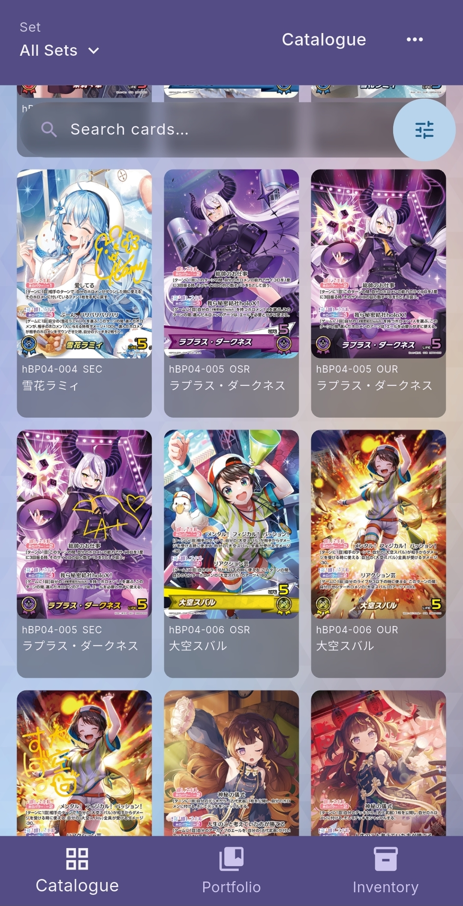
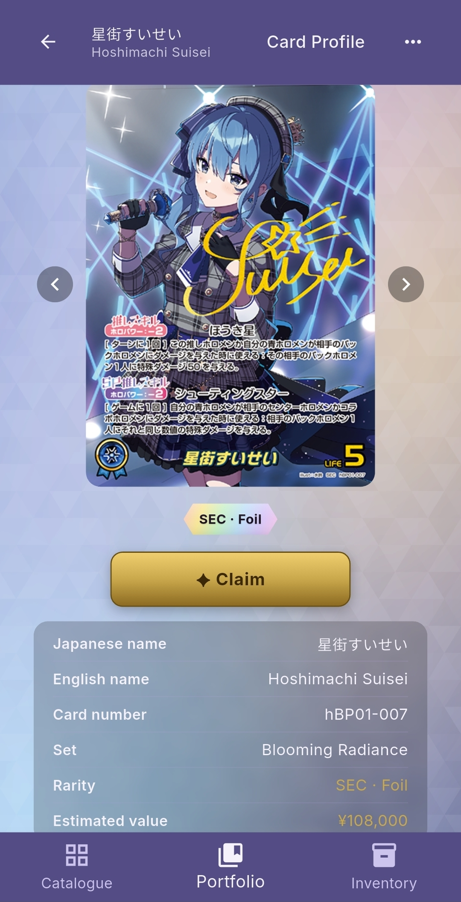
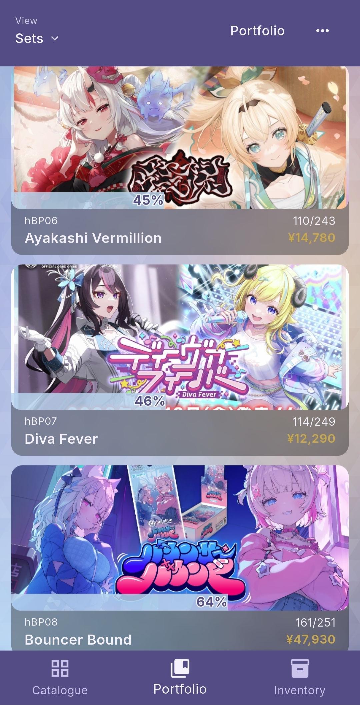
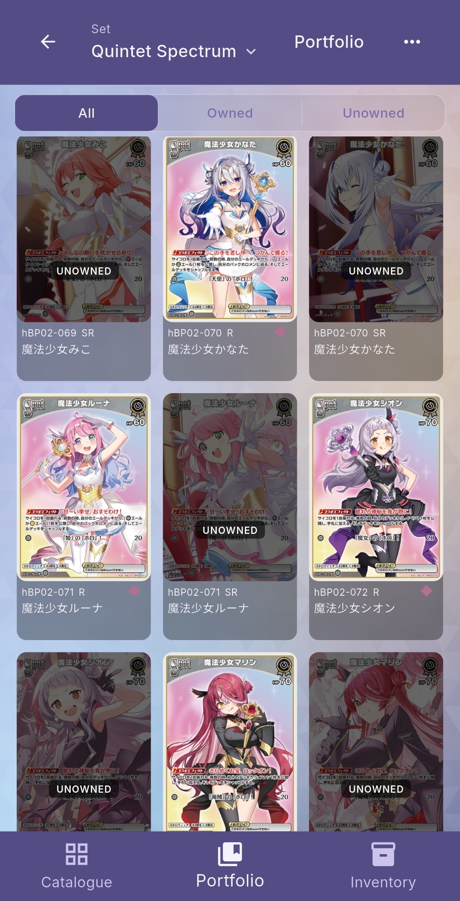
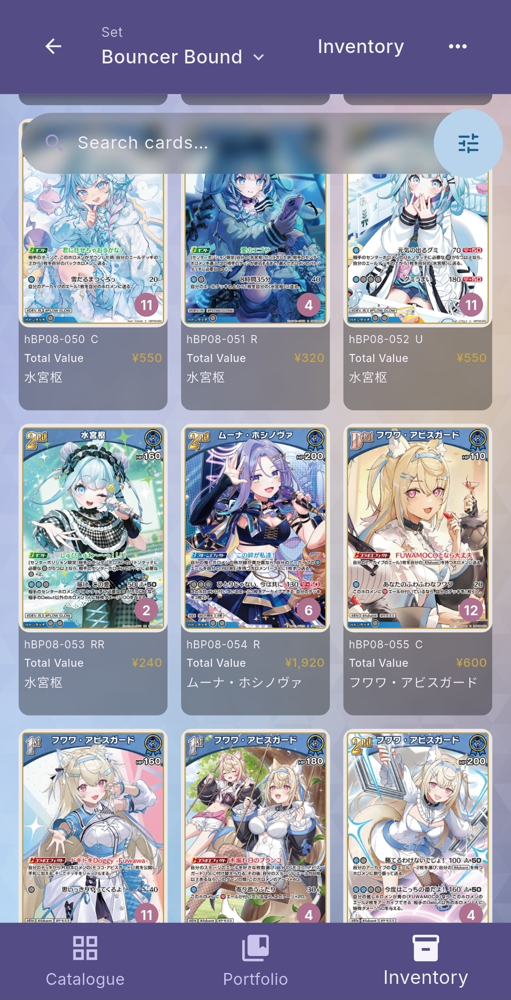
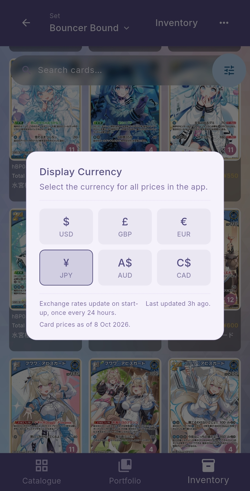
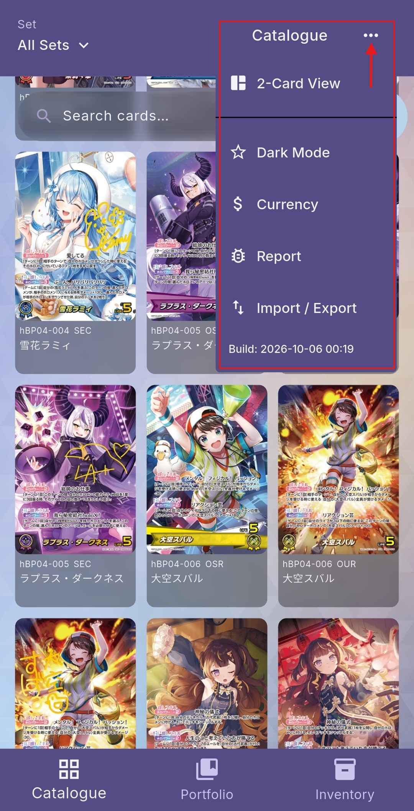

# Oshi Collect

**A collection tracker for the hololive OFFICIAL CARD GAME (Japanese edition).**

Oshi Collect lets you browse every card, mark the ones you own, track your duplicates, and see what your collection is worth, all on your phone and without an account.

> Free, fan-made and non-commercial. Android only for now (iOS may come later).

---

## What's in the app

| | Count |
|---|---|
| **Booster sets**: hBP01 Blooming Radiance → hBP09 Volume Vortex, plus hEB01 Summer Hologram | 2,255 cards |
| **Starter Decks**: hSD01–hSD13, Live Start Decks hSD14–hSD19, and the Holonatsu Paradise set | 368 cards |
| **Promos**: PR packs, tournament prizes, birthday cards, magazine and album bonuses, collabs and more | 449 cards |

Every card has its artwork, Japanese and English names, rarity, foil status and an estimated value. hBP10 Glory Echo is listed as *coming soon*.

---

## Installing

1. Go to the [**Releases**](../../releases) page and download the latest **`Oshi.Collect.apk`** onto your Android phone.
2. Open the downloaded file. If Android asks, allow your browser or file manager to **install unknown apps** (Settings → Apps → *your browser* → Install unknown apps).
3. Tap **Install**.

**Updating:** download the newer APK and install it the same way. It installs over the old version and keeps your collection.

> **Tip:** before reinstalling or changing phones, back up your collection with **••• → Import / Export** (see [Options](#options-the--menu)).

---

## Features & how to use them

### Catalogue: browse every card

The **Catalogue** tab shows every card in a 3-per-row grid.

- **Pick a set:** tap **Set ▾** (top-left) and choose from the **Booster Sets**, **Starter Decks** or **Promos** tabs. Choose *All Sets* to see everything, or *All Promos* for every promo at once.
- **Search:** type in the search bar to find cards by Japanese or English name, card number (e.g. `hBP01-007`), or member, so searching *Suisei* also finds support cards she appears on.
- **Filter:** tap the **sliders button** next to the search bar to filter by **Owned / Unowned**, **Foil**, **Rarity**, **Archetype** (colour) and **Estimated Value**.
- **Open a card:** tap any card to see its full details on the Card Profile.

 

### Card Profile: claim cards & count duplicates

Tap any card in the app to open its **Card Profile**: large artwork, rarity, set, card number, both names and its estimated value.

**How to claim a card (add it to your collection):**

1. Find the card in the **Catalogue** (or a set in Portfolio) and tap it.
2. Tap the gold **✦ Claim** button. It changes to **✓ Claimed**, and the card now counts towards your Portfolio.
3. Got extra copies? Use the **+ / −** buttons in the **Duplicates** panel to record how many spares you have. These show up in your Inventory.

**To unclaim**, double-tap **✓ Claimed** and confirm. Your duplicate count is kept.

Use the **‹ ›** arrows beside the artwork to step through the other cards in the same list without going back.

 

### Portfolio: your collection, set by set

The **Portfolio** tab shows each booster set with:

- a **progress bar** with the percentage of the set you've claimed
- **cards owned / total** in the set (every rarity counts, for a truthful completion figure)
- the **estimated value** of the cards you own from that set

Tap a set to open it.

 

### Set view: owned & unowned at a glance

Inside a set, use **All / Owned / Unowned** at the top to switch views. Cards you don't own yet are dimmed with an **UNOWNED** label, and a small **pink dot** marks cards you have duplicates of.

Switch to another set with the **Set ▾** title at the top, without going back.

 

### Inventory: your duplicates

The **Inventory** tab is for your spare copies, which is handy for trading.

- Each set shows how many duplicates you have, their total value, and your most valuable spare.
- Inside a set, only cards with duplicates are shown. The **number badge** on the artwork is how many spares you have, and **Total Value** is that card's price × your spares.
- Tap the **sliders button** to **sort** (Card Number, Most Duplicates, Highest Total Value, Highest Single Value) or filter by Rarity, Foil and Archetype.

 

### Currency & prices

**Changing your currency:**

1. Tap **•••** (top-right on any screen).
2. Tap **Currency**.
3. Choose **USD, GBP, EUR, JPY, AUD** or **CAD**. Every price in the app switches straight away.

**About the prices:**

- Prices are **estimated market values in Japanese yen**, taken from Japanese card shops (Yuyutei, with Fullahead filling gaps). Other currencies are converted using exchange rates that refresh once a day.
- **Prices update automatically.** The app checks for new prices each time you open it, so no app update is needed. The **Currency** window shows the date of the prices you're seeing ("Card prices as of …").
- A card showing **"No price yet"** simply has no reliable price listed yet. It's never shown as ¥0.
- Works offline too: the app keeps the last prices it downloaded.

 

### Options: the ••• menu

Tap **•••** in the top-right corner of any screen:

- **2-Card / 3-Card View:** bigger or smaller card grid (Catalogue).
- **Dark Mode / Light Mode:** switch themes; your choice is remembered.
- **Currency:** see [Currency & prices](#currency--prices).
- **Report:** spotted a wrong price, name or missing card? Send a short report straight to the developer. Reports sent from a Card Profile include that card's details automatically.
- **Import / Export:** **Export** saves your whole collection (claims and duplicates) as a `.csv` file you can keep somewhere safe. **Import** loads it back, e.g. on a new phone or after reinstalling.
- The bottom of the menu shows which **version** you have installed.

 

---

## Your data

- Your collection lives **only on your phone**. No account and no sign-in, and nothing about you is uploaded.
- The app connects to the internet only to load card images, card prices and exchange rates, and to send a report if you choose to.
- Android's own backup may include your collection, but **Import / Export** is the reliable way to keep a copy.

**What a report sends.** A report is sent only when you tap send, and it contains **only**:

| Sent | Example |
|---|---|
| The type of report | *General* or *Card Data* |
| The screen you sent it from | *Card Profile* |
| The card's details, if sent from a Card Profile (catalogue ID, number, set, rarity, English name) | *16 \| hBP01-007 \| hBP01 \| SEC \| Hoshimachi Suisei* |
| The app version | *1.1.0+2* |
| The message you typed | *"This price looks wrong"* |

That's all. **No** device or phone details, device IDs, location, contacts, account, or anything from your collection is collected or sent.

---

## Where the data comes from

- **Card details:** the official [hololive OFFICIAL CARD GAME card list](https://hololive-official-cardgame.com/cardlist/), plus community-maintained promo records.
- **Prices:** Japanese card shops [Yuyutei](https://yuyu-tei.jp/) and [Fullahead](https://fullahead-sdbs.com/), updated regularly.

Found a mistake? Use **••• → Report** in the app.

---

## Disclaimer

Oshi Collect is an **unofficial, fan-made app**. It is not affiliated with, endorsed by or sponsored by COVER Corporation, hololive production or the hololive OFFICIAL CARD GAME. All card names, artwork and trademarks belong to their respective owners and are used for identification only. Prices are estimates for reference and are not offers to buy or sell.

---

  Designed by <b>Gokai Goblin</b> 
  A <b>Standby Interactive</b> project

